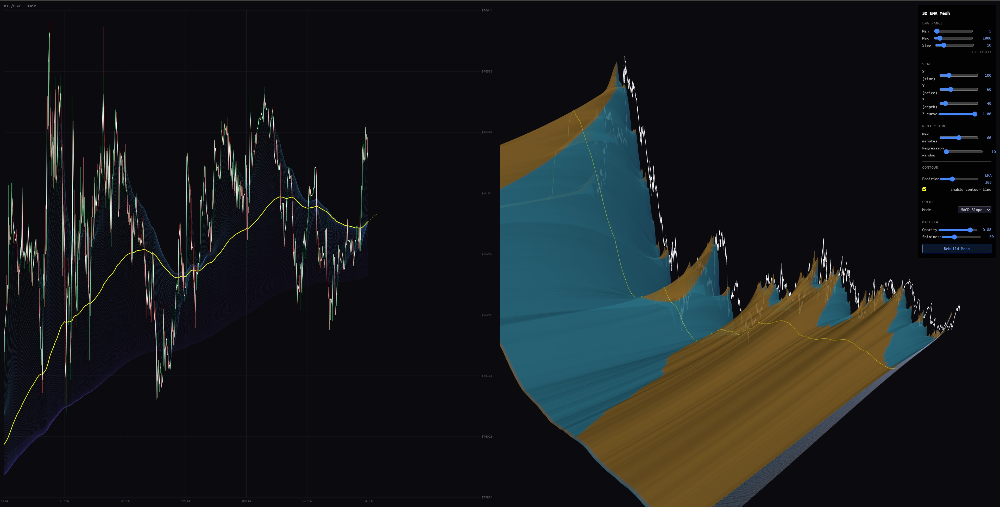

# 3D EMA Mesh Viewer

Interactive Three.js visualization that transforms BTC price data into a 3D mesh surface using multiple Exponential Moving Averages.




## What it does

Takes 1-minute BTC/USD candle data and computes EMAs across a configurable range of periods (e.g. 5 to 1000). Each EMA becomes a row in a 3D grid — time on X, price on Y, EMA period on Z — and the rows are connected into a continuous mesh surface.

### Features

- **3D EMA surface mesh** with configurable period range, step size, and axis scaling
- **MACD slope coloring** — vertex colors show bullish/bearish divergence between adjacent EMA periods
- **Price projection** — extends the surface forward using linear regression on surface normals
- **Contour line** — slide a cross-section along the EMA period axis to extract a single interpolated EMA curve
- **2D chart view** — split-screen with a traditional price chart showing the same data, with pan/zoom
- **Z-curve scaling** — exponential depth axis to stretch out the detailed short-EMA region
- **Interactive controls** — real-time parameter adjustment via the control panel

## Setup

1. Clone the repo
2. Serve locally (needs HTTP for fetch):
   ```
   npx http-server -p 8080 -c-1
   ```
3. Open `http://localhost:8080`

The included `btc_data.json` contains ~2 days of 1-minute BTC data for testing.

### Using your own data

Run `extract_data.js` against a full OHLCV CSV (Timestamp, Open, High, Low, Close, Volume) to extract the trailing 2 days:

```
node extract_data.js
```

Or replace `btc_data.json` with any array of `{ t, o, h, l, c, v }` objects (timestamp in ms).

## Controls

| Control | Effect |
|---------|--------|
| EMA Min/Max/Step | Range and density of EMA periods |
| Scale X/Y/Z | Stretch each axis |
| Z Curve | Exponential depth scaling (lower = more detail at short EMAs) |
| Projection | Forward extrapolation using surface normals |
| Contour | Slide a cross-section line along the period axis |
| Color Mode | Price Level or MACD Slope |
| Opacity/Shininess | Material properties |

## Tech

- Three.js (r164) via CDN import map
- Canvas 2D for the chart panel
- No build step, no dependencies
